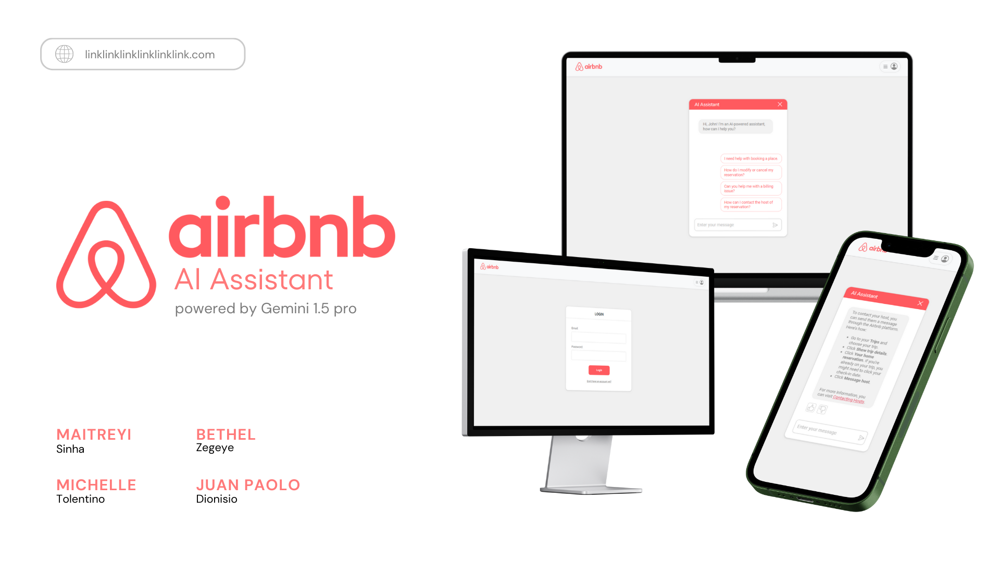
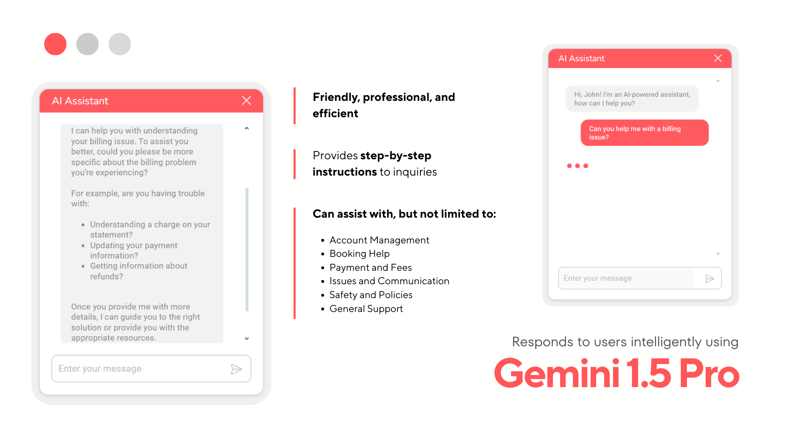
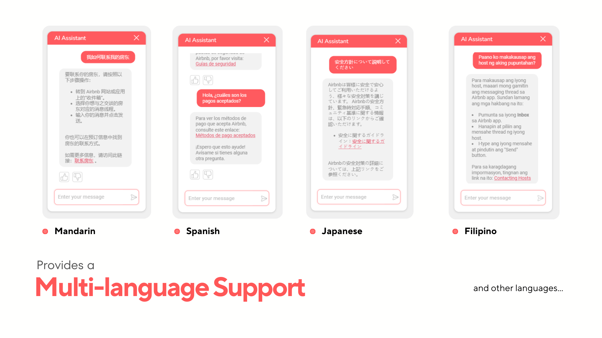
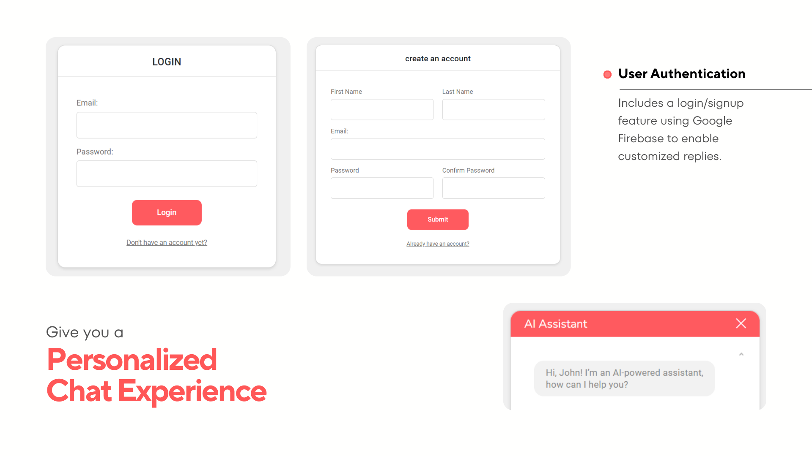
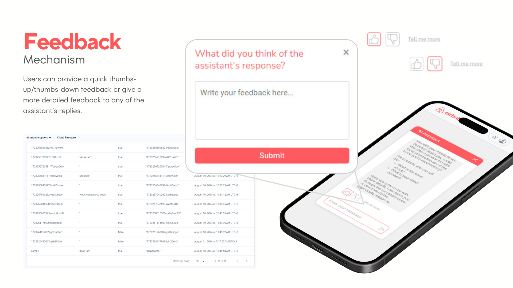
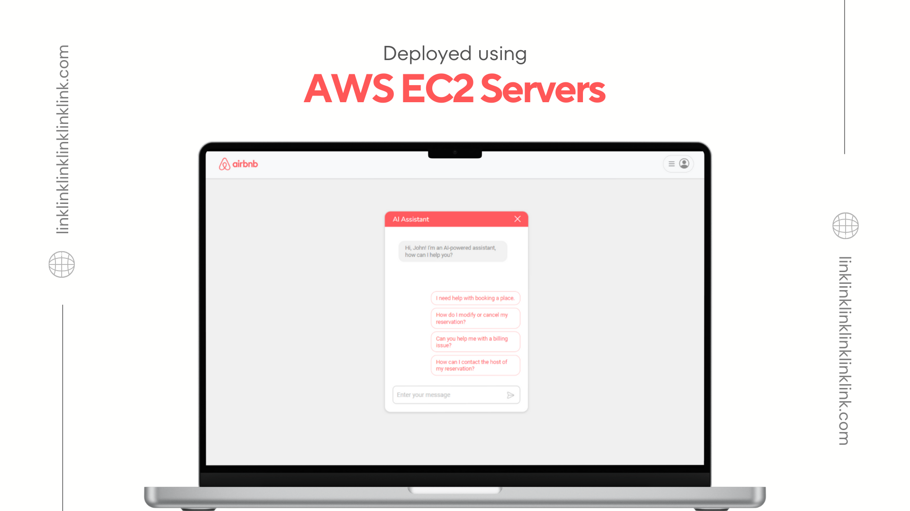

## Airbnb AI Customer Support Assistant

Powered by Gemini 1.5 Pro. It is designed to enhance user experience with intelligent, personalized assistance.
It addresses concerns and FAQs regarding Airbnb's usage, utilizes markdown formatting for clear and engaging replies,
supports multiple languages for global accessibility, and includes a feedback mechanism for continuous improvement.

  
  
  
  
  
  
  

 
 

## Quick Guide

1. **Clone the Repository:**
   - Open your terminal and run: `git clone https://github.com/matchi-1/Airbnb-AI-Customer-Support.git`
2. **Install dependencies:**
   - Make sure you have Node.js installed. If not, you can install it [here](https://nodejs.org/en).
   - Run: `npm install`
3. **Run the program**
   - Run: `npm start`
